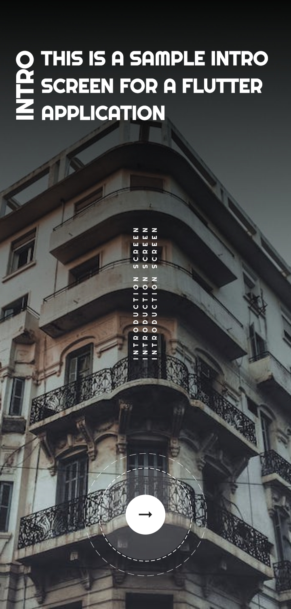

# introduction_screen

A simple introduction screen for flutter apps.

## Getting Started

Clone this repo:
    
```bash
git clone https://github.com/Fluttervein/Introduction-Screen.git
```

Go to project dir and run:

```bash
flutter pub get
```

Run the app:

```bash
flutter run
```

Enjoy!

## Screenshots

